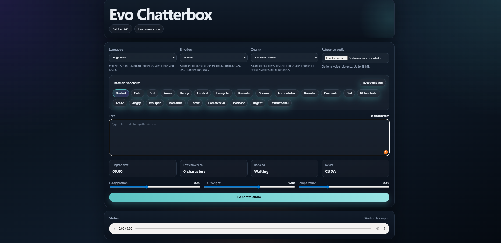

# Evo Chatterbox Portable

Aplicação local para gerar áudio com interface web, `FastAPI` e suporte a GPU NVIDIA quando disponível.



## Visão geral

O projeto foi preparado para usuários que querem abrir, clicar e gerar áudio sem precisar configurar o servidor manualmente.

O launcher principal é [INICIAR.bat](./INICIAR.bat). Ele:

- detecta um `Python portable` local, se existir
- usa o Python instalado no Windows, se necessário
- cria o ambiente `.venv`
- instala dependências
- detecta GPU NVIDIA
- ativa `CUDA` quando possível
- abre a interface automaticamente no navegador

## Recursos

- interface web local
- suporte a texto para fala
- seleção de idioma
- suporte ao modelo padrão e ao modelo multilíngue
- upload opcional de áudio de referência
- presets de emoção
- modo de estabilidade para textos longos
- contagem de caracteres
- cronômetro de geração
- API `FastAPI` com `/docs` e `/redoc`

## Requisitos

### Sistema operacional

- Windows 10 ou Windows 11 64-bit

### Python

#### Opção 1: Python instalado

Instale o `Python 3.11` no Windows e marque `Add Python to PATH`:

- Site oficial: https://www.python.org/downloads/windows/

#### Opção 2: Python portable

Se preferir uma distribuição mais portátil, coloque um Python em:

- `python\python.exe`

Guia completo:

- [PYTHON_PORTABLE.md](./PYTHON_PORTABLE.md)

## Requisitos mínimos do computador

Para o leitor ter noção da configuração esperada, estes são requisitos mais realistas para uso local:

- Processador mínimo: `Intel Core i5` de 4 núcleos / 8 threads ou `AMD Ryzen 5` equivalente
- Memória RAM mínima: `8 GB`
- Memória RAM recomendada: `16 GB`
- Espaço livre em disco recomendado: `10 GB` ou mais, por causa do ambiente virtual, cache e modelos
- GPU: opcional

Sem GPU dedicada, o sistema funciona em CPU, mas a geração pode ficar mais lenta, principalmente em textos longos.

## Configuração recomendada

Como referência de boa experiência de uso:

- Processador recomendado: `Intel Core i5` de 10ª geração ou `AMD Ryzen 5` equivalente
- Quantidade recomendada de núcleos e threads: `6 núcleos / 12 threads`
- Memória RAM recomendada: `16 GB`
- GPU recomendada: `NVIDIA RTX 3060 8 GB` ou `RTX 3070 8 GB`

Essa configuração não é obrigatória. Ela serve apenas para mostrar um nível de hardware em que o uso local tende a funcionar muito bem.

## Como instalar e usar

1. Baixe ou clone este projeto.
2. Garanta uma destas opções:
   - Python 3.11 instalado no Windows
   - ou um Python portable em `python\python.exe`
3. Dê duplo clique em [INICIAR.bat](./INICIAR.bat).
4. Aguarde a configuração inicial.
5. O navegador será aberto automaticamente.

Se quiser encerrar o sistema depois, feche a janela `Evo Chatterbox Server`.

## GPU e CPU

- Se existir GPU NVIDIA compatível, o sistema tenta usar `CUDA`.
- Se não existir GPU, ele continua funcionando em `CPU`.
- A detecção automática não muda a qualidade do áudio de forma relevante; ela melhora principalmente a velocidade.

Override manual:

- `CHATTERBOX_DEVICE=auto`
- `CHATTERBOX_DEVICE=cpu`
- `CHATTERBOX_DEVICE=cuda`

## Estabilidade e validações

- A opção `Estabilidade` não troca de modelo; ela muda principalmente o chunking e as pausas entre trechos.
- `Estabilidade alta` e `Estabilidade equilibrada` tendem a soar melhor em textos longos.
- `Processamento direto` costuma ser mais rápido, mas pode perder estabilidade em entradas longas.
- O áudio de referência aceita `.wav`, `.mp3`, `.flac`, `.m4a` e `.ogg`, com limite de `15 MB`.
- Cada requisição gera um arquivo temporário próprio para evitar conflito entre chamadas simultâneas.

## Testes

Para executar os testes unitários:

```powershell
.\.venv\Scripts\python.exe -m unittest discover -s tests -v
```

Os testes cobrem validação, divisão de texto, seleção de backend e o contrato básico do endpoint.

## Estrutura principal

- Launcher principal: [INICIAR.bat](./INICIAR.bat)
- Backend: [app.py](./app.py)
- Interface: [static/index.html](./static/index.html)
- API: [API.md](./API.md)
- Guia portable Windows: [PORTABLE_WINDOWS.md](./PORTABLE_WINDOWS.md)
- Guia de Python portable: [PYTHON_PORTABLE.md](./PYTHON_PORTABLE.md)
- Postman: [postman_collection.json](./postman_collection.json)

## Documentação da API

Quando o servidor estiver rodando localmente:

- App: `http://127.0.0.1:8000`
- Swagger UI: `http://127.0.0.1:8000/docs`
- ReDoc: `http://127.0.0.1:8000/redoc`

Guia completo:

- [API.md](./API.md)

## Publicação no GitHub

Arquivos auxiliares para publicação:

- Checklist: [PUBLISH_GITHUB.md](./PUBLISH_GITHUB.md)
- Release notes: [RELEASE_TEMPLATE.md](./RELEASE_TEMPLATE.md)
- Checklist de release portable: [CHECKLIST_RELEASE_PORTABLE.md](./CHECKLIST_RELEASE_PORTABLE.md)

## Observações

- O primeiro uso pode demorar porque o sistema baixa dependências e modelos.
- Todos os caches ficam dentro da pasta do projeto.
- Para usuários finais, o melhor caminho costuma ser:
  - repositório GitHub sem Python embutido
  - release ZIP com Python portable embutido
